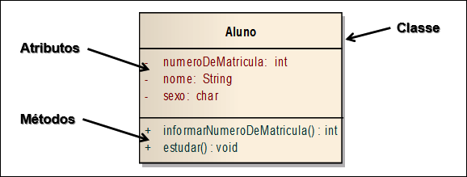
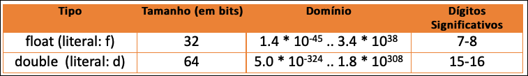
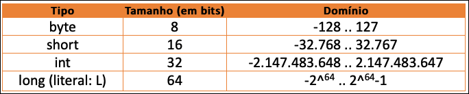
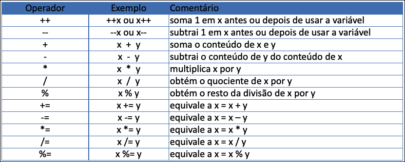

# Introdução à Programação - Unidade 3

## Introdução a Linguagem de Programação
> Videoaula 3_VideoAula-1 (27:27):
> [https://web.microsoftstream.com/video/89f89c67-9576-4360-bbbe-824544b76e6d](https://web.microsoftstream.com/video/89f89c67-9576-4360-bbbe-824544b76e6d
> "primeira videoaula da unidade 3") 
> Videoaula 1_VideoAula-3 (27:27): [link
> alternativo](https://furb-my.sharepoint.com/:v:/g/personal/dalton_furb_br/EexdwuO8TYFOjqLwiIFsk-IB19zRU8PVB3l3eLQobAniRQ?e=RxPPdf
> "link alternativo da primeira videoaula da unidade 3")
>  

### A Linguagem Java
- Plataforma de programação iniciada pela Sun Microsystems e atualmente pertencente a Oracle;​
- Linguagem de programação de propósito geral, concorrente, baseada em classes e orientada a objetos;​
- Possui algumas semelhanças com as linguagens C e C++;​
- É uma linguagem case sensitive, ou seja, diferencia maiúsculas de minúsculas e fortemente tipada;​
- Independente de plataforma, pois seus programas são compilados em um formato próprio denominado bytecodes (.class).

#### Características da Linguagem  Java
- Origem:​
  - linguagem originalmente desenvolvida para eletrodomésticos, portanto, simples e portável;​
  - foi projetada para ser uma linguagem com características modernas de programação;​
  - nasceu considerando a Internet como ambiente operacional.​
- JRE x JDK​
  - JRE (Java Runtime Environment): são as bibliotecas necessárias para executar um programa em Java​
  - JDK (Java Development Toolkit): são as ferramentas necessárias para desenvolver aplicações em Java​
- Versões​
  - SE / EE / ME / FX​

#### Orientação a Objetos​
- A **Orientação a Objetos** (OO) modela o mundo a partir dos objetos existentes no mundo real.
- Os objetos têm **Características** (atributos)  e **Comportamentos** (métodos) próprios, sendo definidos pelas **Classes** às quais pertencem.

#### Estrutura de um Programa Java​
- Em Java as classes tem uma estrutura básica:

        public class Nome_da_classe {​
          //declaração dos atributos​
          //declaração e implementação dos métodos​
        }
        Exemplo:
        //classe
        public class Pessoa {​
        }
        
- Deve-se notar o uso de **Chaves** para iniciar e fechar uma classe em Java.​
- Por convenção o nome de uma classe sempre é iniciado por letra maiúscula.​
- Uma aplicação desenvolvida em Java pode ser executado de **diversas formas**:
  - no contexto de uma aplicação desktop em **modo texto** ou **modo gráfico**, como um **applet** ou como uma **aplicação JSP** na WEB, em um dispositivo móvel, etc.​
- No nosso contexto, trataremos apenas de uma aplicação *desktop*.​

##### Estrutura de um Programa Java​: Método Main
- Um programa *desktop* em Java é executado a partir de uma classe.​
- Esta classe deve ter um método denominado **main**.​
- Sintaxe:​

        public class Principal {​
            public static void main (String args[]) {​
            }
        }

- Exemplo: a classe a seguir irá escrever o conteúdo do comando System.out.println em uma janela em modo texto.
 
        public class Principal {​
            public static void main (String args[]) {​
                System.out.println (“FUNCIONA!!”);
            }
        }

#### Palavras Reservadas e Identificadores em Java​
- **Palavras Reservadas** são todos os nomes pré-existentes na linguagem que tem algum significado.
  - Exemplos de palavras reservadas: public, class, int, double, etc.​
- **Identificadores** são todos os nomes criados pelo programador. São utilizados para nomear classe, atributos e métodos. Os identificadores não podem ter nomes que sejam palavras reservadas. Devem iniciar por letras.​

#### Definição de Variáveis em Java​
- Em Java as variáveis devem ser declaradas e ter o seu tipo definido.​

        tipo nome_variável;​
  ou

        tipo nome_variável = valor​;
  ou

        final tipo nome_variável = valor;
  Onde:​

        tipo: é o tipo da variável;​
        nome_variável: é o nome dado a variável;​
        valor: inicialização do variável;​
        final: indica que o valor do variável não pode ser alterado (é constante).
  Exemplos:​

        char letra;​
        int numero = 10;​
        final double tamanho = 50;

#### Palavras Reservadas e Identificadores em Java​
- É possível definir um **Grupo de Variáveis** em uma mesma linha, usando o mesmo qualificador e tipo, separando-os por vírgula (,)​.
- A definição de uma variável, ou grupo de variáveis, sempre é finalizada com o símbolo **Ponto-E-Vírgula** (;). Isto ocorre com a maioria dos programas em Java.​
- Exemplo

        private char letra, caracter;​
        private int x, y = 2, z;

#### Tipos de Dados: Primitivos​
##### Numéricos Reais

##### Numéricos Inteiros

##### Alfanumérico

##### Lógico

### Exercícios
- Responda o quiz no AVA3​.
- Acompanhe os exercício em sala​.

----------

##  Introdução a Linguagem de Programação
> Videoaula 3_VideoAula-1 (29:18):
> [https://web.microsoftstream.com/video/26b0c4f5-a13d-4d03-95ed-cfeb06c3ed41](https://web.microsoftstream.com/video/26b0c4f5-a13d-4d03-95ed-cfeb06c3ed41
> "primeira videoaula da unidade 3") 
> Videoaula 1_VideoAula-3 (29:18): [link
> alternativo](https://furb-my.sharepoint.com/:v:/g/personal/dalton_furb_br/ERMgPFCa4U1Gv3qfgMUkXTQB41NigTaNnEBotCUX63uBAw?e=BLavhh
> "link alternativo da primeira videoaula da unidade 3")
>  

### Operadores em Java

#### Atribuição
- O operador de **Atribuição** na linguagem Java é o **sinal de igual**.​
- Na **Atribuição** a variável à esquerda recebe o valor da expressão à direita​.
  - Exemplos

    x = 100;
    y = x + 3;

#### Aritméticos
- Os operadores aritméticos permitem a execução de operações sobre as variáveis​.

### Comandos de Entrada e Saída
- Nas aplicações em modo texto, a interação do usuário com o sistema é feita através de uma janela em modo caractere, sem o uso de componentes gráficos.​
- As classes usadas são a classe **Scanner** (entrada) e **System** (saída)​.

#### Entrada
- A entrada de dados em modo Texto pode ser feita usando a classe **Scanner​**;
- A classe **Scanner** precisa da criação de um objeto para ser utilizada​;
- O parâmetro System.in na criação do objeto indica que a leitura é feita do **teclado**;

      Scanner tec = new Scanner (System.in);​

- Alguns métodos disponíveis para leitura:​

  | Comando       | Descrição                       |
  | ----          | ----                            |
  | nextInt()     | lê um valor inteiro​             |
  | ​next()        | lê um string​                    |
  | nextDouble()  | lê um número real​               |
  | nextBoolean() | lê um valor lógico​              |

- A classe Scanner pertence ao pacote java.util.Scanner e, portanto, deve ser importada.​
​
#### Saída
- Para a escrita de dados em vídeo utiliza-se diretamente a classe **System**;
- Para usar a classe System **não** é necessário a criação de um objeto;
- Na classe System utiliza-se o objeto **out** seguido pelos métodos:​
  - println: para exibir texto ou valores sem formatação​;
  - printf: para exibir texto ou valores formatados​.
​
Nos métodos print pode ser feita a concatenação de textos e conteúdos de variáveis, usando o operador +.​